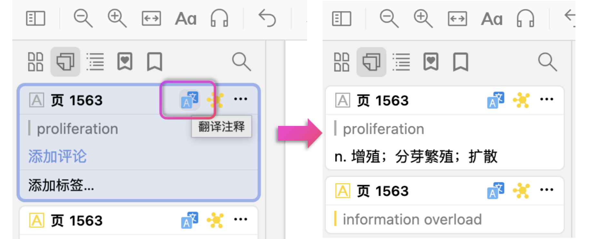

# Zotero Wordbook

从 PDF 高亮提取生词，获取原句和释义，导出生词本，支持 txt（不背单词格式）和自定义字段 CSV（可提取原句，可用于导入 Anki）。

> 本质自用。因为本人右键选项卡比较杂乱就把导出的位置塞到**工具**了。个人Translate 插件配置见下。开发计划写的直接打包成 Anki 牌组会适配个人魔改后的 Quizify 模板（[原版](https://ankiweb.net/shared/info/1929979604)），届时一并上传。

## 前置准备

**1. 安装 Translate for Zotero 插件**

- 项目地址：[https://github.com/windingwind/zotero-pdf-translate](https://github.com/windingwind/zotero-pdf-translate)
- 在 Zotero 中安装插件

**2. 配置 Translate 插件**

打开 **设置 → Translate**：

- 取消分隔符，**分隔符（原文与翻译之间）** 一栏留空
- 选中 **使用字典服务翻译词语**，字典服务使用 **海词词典**
- 个人习惯手动点击翻译,翻译结果将保存到标注评论，可编辑修改

## 使用方法

1. 在 PDF 阅读器中高亮生词（使用设定的目标颜色）
2. 点击标注旁的翻译按钮，获取释义
3. **工具 → 单词本**：
   - **从当前文档导出**（在 PDF 阅读器内使用）
   - **从选中条目导出**（在库列表中使用）
4. 选择导出格式和位置

## 导出格式

- **不背单词**：每行一个单词的 TXT 文件
- **CSV**：可自定义字段（**单词、释义、例句、来源**）和列标题

## 插件设置

打开 **设置 → Wordbook**：

- **目标高亮颜色**：只导出该颜色的高亮标注
- **导出格式**：TXT 或 CSV
- **CSV 字段配置**：勾选字段、调整顺序、自定义列标题

## 开发计划

- **颜色选择器**：将颜色输入框改为可视化颜色选择器
- **用户提示**：无翻译信息、颜色配置为空等情况的友好提示
- **原句提取**：持续优化算法，提升句子边界识别准确率
- **生词预览**：在 Zotero 中查看所有单词卡片
- **Anki 导入**：直接打包成牌组，支持添加音标、发音、生词在原句中加粗等

## License

AGPL-3.0-or-later
